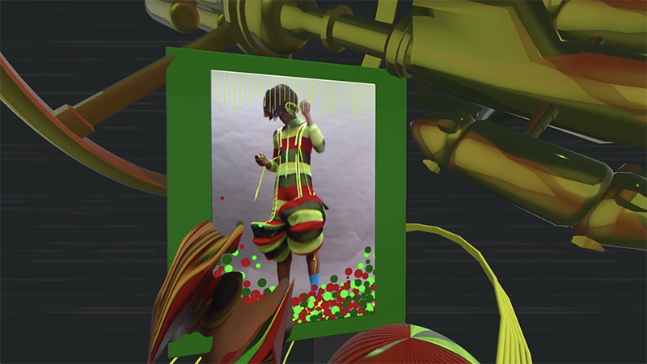
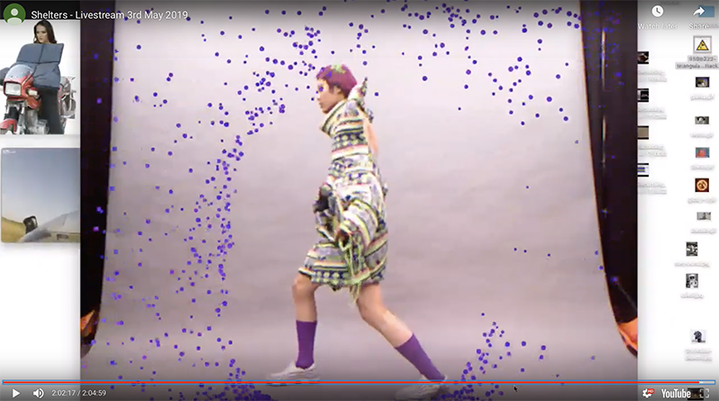

# Safety warning (Fashion film)

Videos and project details please the project page check [HERE](https://bingcomputing.hotglue.me/?safetyWarning)

-

2019

#OpenFrameworks #Kinect

Credit: Digital Art Direction, Creative technologist, Videography and Film Edit

-

SAFETY WARNING (Welcome to the Spiceship) is an experimental fashion film project using interactive video visual processing built with computer vision techniques during the filming process to explore a new way of fashion presentation/performance, which transforms the camera from a documenting recorder to a live narrative editor.
